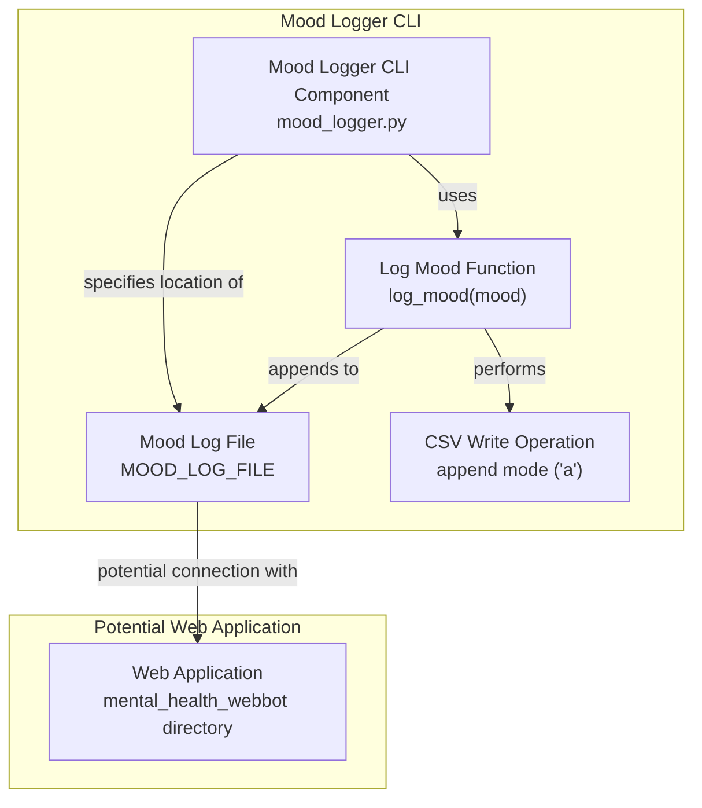

# Codebase Research Report

## Query
Investigate the "Mood Logger CLI" component in detail. Focus your analysis on these key files:
1. mood_logger.py (c:/Users/MSI/Desktop/chat_t_bot_hackathon/mood_logger.py)

Provide insights about the component's main responsibilities and functionality and how it integrates with other system components

## Answer
### System Diagram

### Summary
# CodeViz Mood Logger CLI Component Analysis

## Overview

This report analyzes the `Mood Logger CLI` component, focusing on the `mood_logger.py` file. Due to limited information on its integration with other components, the analysis is primarily based on the file's internal structure and functionality.

## mood_logger.py Analysis (file:mood_logger.py)

### Main Responsibilities and Functionality

-   The `mood_logger.py` file is responsible for logging mood data to a CSV file.
-   It defines a constant `MOOD_LOG_FILE` which likely specifies the path to the CSV file where mood data is stored.
-   It contains a function `log_mood(mood)` that takes a mood as input and writes it to the `MOOD_LOG_FILE` along with a timestamp.

### Key Elements

-   **MOOD_LOG_FILE:** (file:mood_logger.py) Specifies the location of the mood log file.
-   **log_mood(mood):** (file:mood_logger.py) Function responsible for writing the mood and timestamp to the log file.

### Assumed Workflow

1.  The `log_mood` function is called with a mood value.
2.  The function retrieves the current timestamp.
3.  The function opens the `MOOD_LOG_FILE` in append mode.
4.  The function writes the mood and timestamp as a new row in the CSV file.

### Integration with Other Components

-   Based on the analysis, the `log_mood` function doesn't seem to be directly called by other components. It's possible that it's triggered indirectly or used as a standalone utility. Further investigation is needed to determine the exact integration points.
-   The `mood_log.csv` file (file:mental_health_webbot/mood_log.csv) in the `mental_health_webbot` directory suggests a potential integration point with the web application.

## Further Investigation

To gain a deeper understanding of the `Mood Logger CLI` component, the following areas should be investigated:

-   Identify which components call the `log_mood` function.
-   Determine how the mood data is used by other parts of the system.
-   Investigate the interaction between `mood_logger.py` and the `mental_health_webbot` directory, specifically the `mood_log.csv` file.

## Walkthrough Steps

### 1. Mood Logger CLI Component Overview
The `Mood Logger CLI` component is designed to log mood data to a CSV file. The core functionality resides within the `mood_logger.py` file. It centers around writing mood entries, along with timestamps, to a designated log file.

### 2. Understanding the MOOD_LOG_FILE Constant
The `MOOD_LOG_FILE` constant specifies the location where mood data is stored. This file path is crucial for the `log_mood` function to correctly append new mood entries.

### 3. The log_mood Function
The `log_mood(mood)` function is the primary interface for logging mood data. It accepts a `mood` value as input, retrieves the current timestamp, and appends a new row to the `MOOD_LOG_FILE` containing both the mood and the timestamp.

### 4. Writing Mood Data to the Log File
The `log_mood` function opens the `MOOD_LOG_FILE` in append mode (`a`). This ensures that new mood entries are added to the end of the file without overwriting existing data. The function then formats the mood and timestamp as a CSV row and writes it to the file.

### 5. Integration with Other Components (Speculative)
The component's integration with other parts of the system is not explicitly defined within the provided code. However, the presence of `mood_log.csv` in the `mental_health_webbot` directory suggests a potential connection with a web application. Further investigation is needed to confirm this integration.

---
*Generated by [CodeViz.ai](https://codeviz.ai) on 6/6/2025, 11:06:46 AM*
